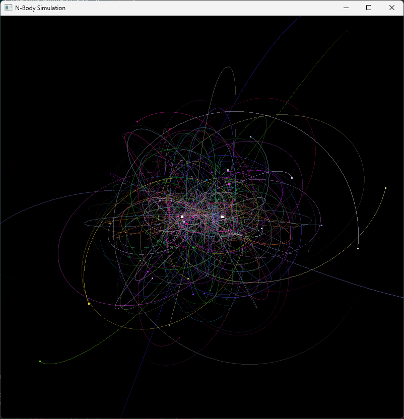

# n-body simulator
A simulator to study the n-body problem and how extremely minor changes in intial conditions propagate into massive changes.
 Also it's really relaxing to watch the orbits.

Written to practice my rusty C++ skills, using the GLFW library with OpenGL for a simple renderer.

Notes:
- Using Gmm/r^2 as the formula, with G reduced in order to scale the simulation down.
- Around the 5000 body mark, the simulation experiences extreme slowdown.
- Can define bodies as immobile.

TODO
- Optimization, approximate mean influence
- Optimization, culling range for gravital effect
- using CUDA for fast calculations
- (inelastic) collisions between masses which result in one larger mass
- Nicer looking points using an actual shader

