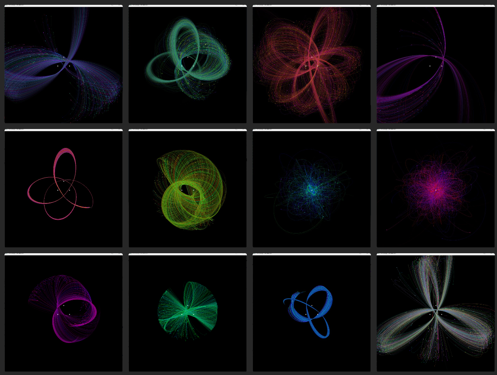

# n-body simulator
A simulator to study the n-body problem and how extremely minor changes in intial conditions propagate into massive changes.
 Also the orbits can create some really cool shapes.

For orbital simulation, can enable collisions between masses as well.
For instability from initial conditions, enable single start point and set a low delta for slower chaos.

Written to practice C++, using the GLFW library with OpenGL for a simple renderer.
Run simulator.exe or compile with MinGW.

https://github.com/b0bhat/n-body-sim/assets/59947126/96f37f84-6c04-4a05-bcc4-24fb626e8154

### Settings in settings.txt:
- Time step value, set lower for slower and more precise simulation (double)
- Single start point, set to 0 to disable, 1 to enable (int)
- Number of minor mobile bodies generated, keep below 10000 (int)
- Delta in inital conditions for single start (double)
- Body collisions, 0 for none, 1 for mobile bodies (int)
- Number of primary masses, 0-3 (int)
- Trail alpha exponential decay rate for visual effect (float) 
- Minimum mass for mobile bodies
- Maximum mass for mobile bodies
- Min size for hue range
- Max size for hue range
- Min velocity range
- Max velocity range
- Min radius from center
- Max radius from center

### Notes:
- Using Gmm/r^2 as the formula, with G reduced in order to scale the simulation down.
- Window restarts after 3 mins.

### Todo Ideas
- Implement the Barnes-hut tree for more efficient calculations
- using CUDA gpu for super fast calculations
- Nicer looking points using an actual shader
